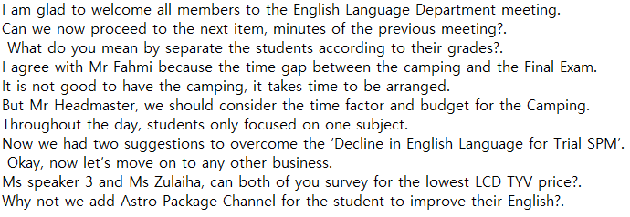
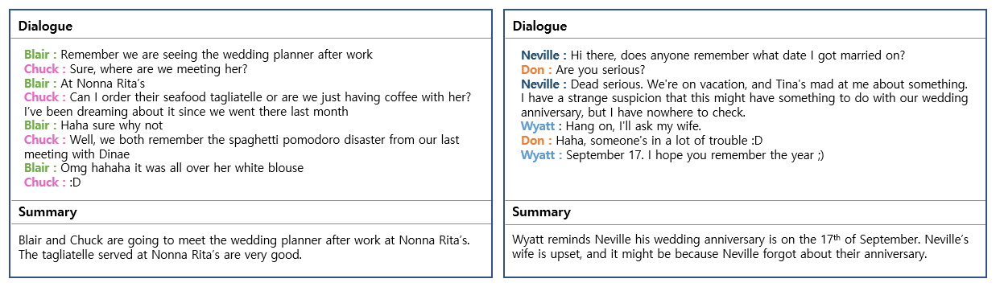
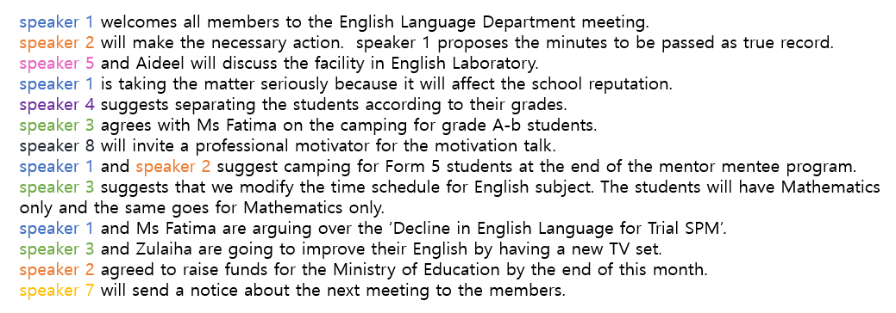

# MoM - Summary 
## Bertsum
- Bert-based Extractive Summarization  
- Word using Clustering (Kmeans) in the Output Vector of BERT Summarization by selecting the closest vector to the vector mean (center)  
- Excellent in task processing speed by using Distillbert, which is lightweight of existing BERT  

## Result
- Results of using *Bertsum*  
 

## Bart
- a denoising autoencoder for pretraining sequence-to-sequence models  
- pre-trains a model combining Bidirectional and Auto-Regressive Transformers  
- trained by 1) corrupting text with an arbitrary noising function, 2) model to reconstruct the original text  
- A key advantage of this setup is the noising flexibility(a number of noising approaches)  
	
## Data - SAMsum
- SAMSung Corpus contains over 16,000 chat conversations with manual annotated summaries  
- Linguists created the conversation by reflecting the percentage of topics in the actual messenger conversation, including various situations such as slang and typos  
- Summary consists of 3rd person based on conversation  

  
- We use SAMsum corpus to fine-tune the bart because the actual conversation is similar to a chat conversation  

## Result
- Results of using ```bart_pretrained_SAMsum.pkl``` 
 
- The result of cutting 4 sentences(Speech Darization X)  

- The result of cutting 4 speakers(Speech Darization O)

